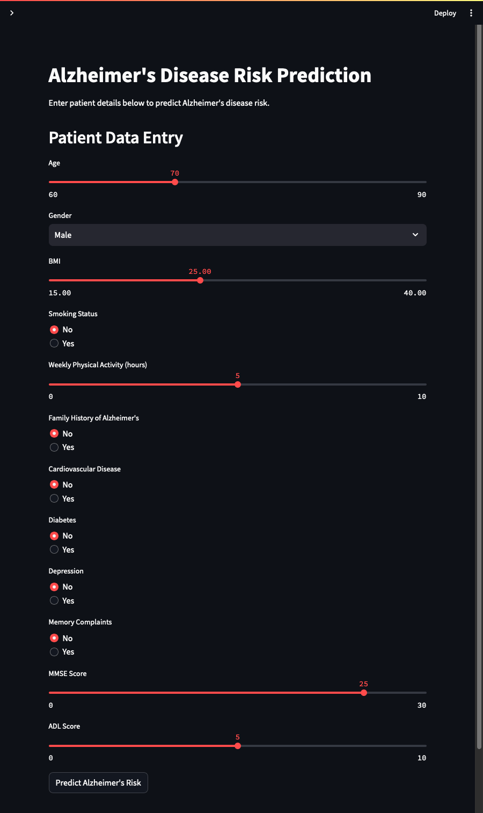

# Alzheimer’s Prediction MLOps


Alzheimer’s disease is a progressive neurological disorder that affects memory, thinking, and behavior, ultimately interfering with daily activities. It is the most common cause of dementia, primarily impacting older adults, and currently has no cure, though early diagnosis and intervention can help manage symptoms and improve quality of life.

This is a machine learning project designed to predict Alzheimer's disease risk based on patient health data. This project implements a simplified MLOps pipeline, enabling efficient data processing, model training, evaluation, and deployment with a user-friendly interface for data exploration and risk prediction.

## Features

- **Data Preprocessing and Feature Engineering**: Automated data cleaning and feature transformation to prepare raw data for model training.
- **Machine Learning Model**: A Random Forest classifier trained to predict the risk of Alzheimer's disease, using relevant health metrics and cognitive assessments.
- **Evaluation**: Model performance is evaluated with classification reports and confusion matrices.
- **Interactive Interface**: A Streamlit app provides an interactive interface for entering patient data, and viewing predictions.
- **Deployment Ready**: Configured for easy deployment on Streamlit Community Cloud, Heroku, or cloud platforms.

## Project Structure

```plaintext
Alzheimer’s-Prediction-MLOps/
├── data/
│   ├── alzheimers_data.csv                # Original raw data
│   └── processed_alzheimers_data.csv      # Processed data for model training
├── ml_pipeline/
│   ├── feature_engineering.py             # Script for data cleaning and feature engineering
│   ├── train_model.ipynb                  # Jupyter notebook for model training and evaluation
│   ├── model/                             # Directory for saved model and scaler
│       ├── alzheimers_model.pkl           # Trained model file
│       └── scaler.pkl                     # Scaler file for data preprocessing
│   └── requirements.txt                   # Dependencies for ML pipeline
├── app.py                                 # Streamlit application for prediction
├── .gitignore                             # Excludes unnecessary files from version control
└── README.md                              # Project description and setup instructions
```

## Installation

1. **Clone the Repository**:

   ```bash
   git clone https://github.com/your-username/Alzheimers-Prediction-MLOps.git
   cd Alzheimers-Prediction-MLOps
   ```

2. **Install Dependencies**:

   ```bash
   pip install -r ml_pipeline/requirements.txt
   ```

3. **Run the Streamlit App**:

   ```bash
   streamlit run app.py

   python -m streamlit run app.py
   ```

## Deployment



This project can be deployed on [Streamlit Community Cloud](https://streamlit.io/cloud), Heroku, Google Cloud, or AWS. See the documentation for setup details.

## Attribution

```
DATA
@misc{rabie_el_kharoua_2024,
title={Alzheimer's Disease Dataset},
url={https://www.kaggle.com/dsv/8668279},
DOI={10.34740/KAGGLE/DSV/8668279},
publisher={Kaggle},
author={Rabie El Kharoua},
year={2024}
}
```
